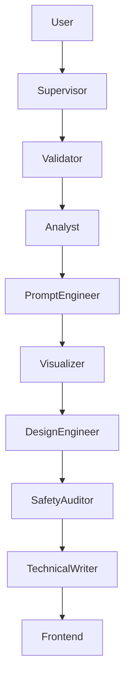

# BionStride 🦾

**BionStride** is an AI-powered design studio that democratizes access to personalized prosthetic devices. Using a multi-agent architecture powered by Google Gemini, it analyzes user simple photos, extracts biomechanical data, and generates 3D-printable prosthetic designs (STL) along with personalized technical documentation.

## 🚀 Features

*   **🔍 AI Vision Analysis**: Extracts anatomical measurements (stump length, circumference) from a single photo using `Gemini 2.5 Flash`.
*   **🤖 Multi-Agent Workflow**:
    *   **Supervisor**: Orchestrates the entire process.
    *   **Validator**: Ensures image safety and relevance.
    *   **Analyst**: Performs anatomical analysis using `Gemini 2.5 Flash` (Vision).
    *   **Prompt Engineer**: Translates biomechanical data into precise visual prompts.
    *   **Visualizer**: Generates photorealistic prosthetic previews using `Gemini 2.5 Flash Image` (Nano Banana).
    *   **Design Engineer**: Calculates physics (wall thickness, material) and generates 3D assets (STL).
    *   **Safety Auditor**: Validates structural integrity (< 3mm rejection loop).
    *   **Technical Writer**: Generates user-friendly assembly guides in the user's native language (Spanish supported).
*   **🖥️ Hacker Console UI**: A "Terminal-style" loading screen that visualizes the agents "thinking" in real-time.
*   **⚡ Real-time 3D**: Generates valid STL files and fabrication parameters.

## 🛠️ Installation

### Prerequisites
- Python 3.10+
- A Google Cloud API Key (for Gemini)

### 1. Backend Setup

```bash
cd backend
python -m venv .venv
# Activate venv:
# Windows: .venv\Scripts\activate
# Mac/Linux: source .venv/bin/activate

pip install -r requirements.txt
```

### 2. Environment Variables

Create a `.env` file in the root directory (or inside `backend/`) based on `.env.example`:

```bash
GOOGLE_API_KEY=your_key_here
```

### 3. Run the Server

From the root directory:

```bash
# Make sure your virtual environment is activated
python -m uvicorn app.main:app --reload
```

The backend API will run at `http://localhost:8000`.

### 4. Frontend

The frontend is a static Vanilla JS application. 
Simply open `frontend/index.html` or `frontend/studio.html` in your browser, or use a simple HTTP server:

```bash
cd frontend
python -m http.server 5500
```
Then visit `http://localhost:5500`.

## 🏗️ Architecture



## ⚠️ Hackathon Note
This project is a prototype developed for the DeepMind/Google Hackathon. Features labeled "Mock" or "Beta" are simulated for demonstration purposes where real hardware/inference APIs might be cost-prohibitive or slow.

---
*Built with ❤️ using LangGraph & Google Gemini*
